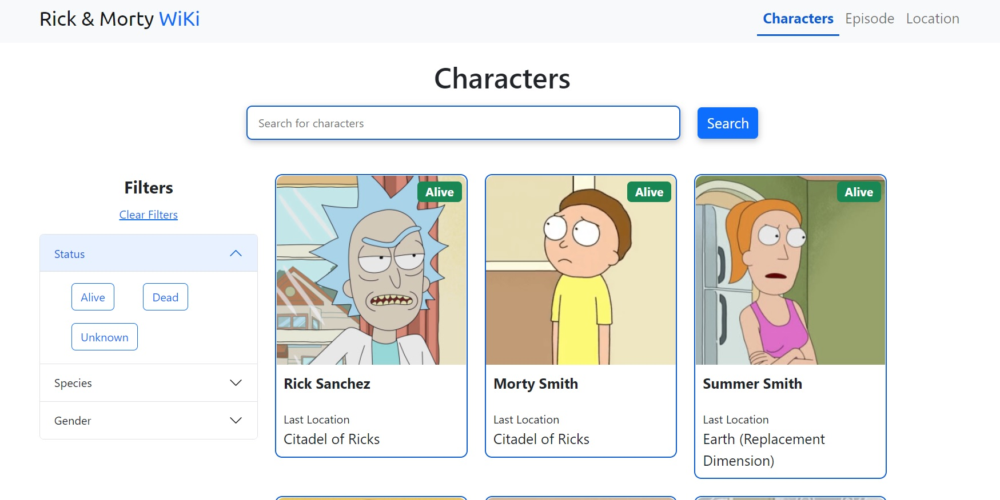
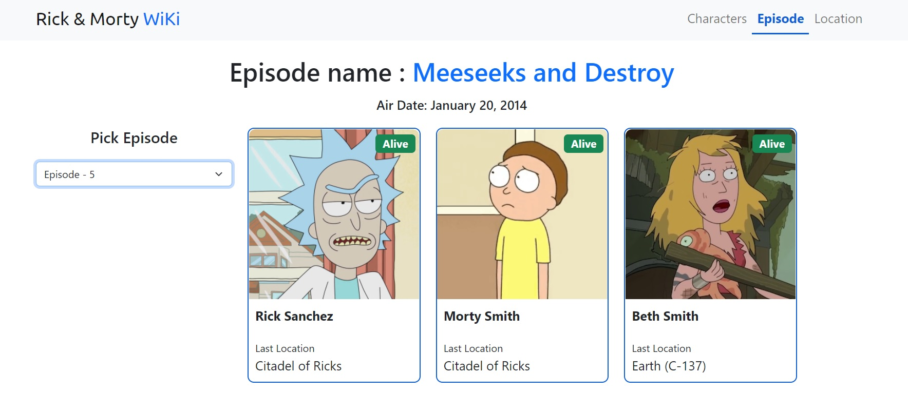
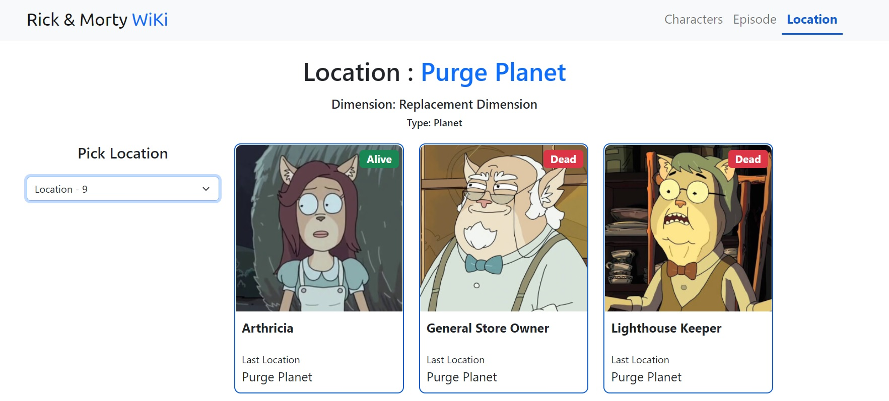
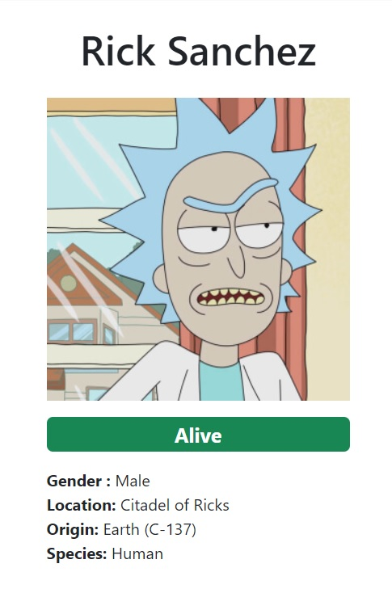

# Rick and Morty Character/Episodes/Locations Wiki

 

## Description

This project was made to practice ReactJS and to learn how to use the Rick and Morty API. It is a simple wiki that allows you to search for characters, episodes and locations from the show. It also allows you to filter the characters by their status and species.

## Demo
[Demo na Vercel](https://rick-and-morty-wiki-three.vercel.app/)

## Features

- Search for characters, episodes and locations
- Filter characters by status, species and gender
- Pagination
- Responsive design
- Dynamic Routing  

## Topics Covered

- React Hooks (useState, useEffect)
- React Components
- Fetch API
- Bootstrap - for styling
- Pagination
- Search bar
- Data Filtering
- Dynamic Routing

## Technologies

- [ReactJS](https://reactjs.org/)
- [React-router-dom](https://reactrouter.com/web/guides/quick-start)
- [Rick and Morty API](https://rickandmortyapi.com/)
- [Bootstrap](https://getbootstrap.com/)
- [@popperjs/core](https://popper.js.org/)
- [sass](https://sass-lang.com/)
- [react-paginate](https://www.npmjs.com/package/react-paginate)

## Project Followed Along

- [Freecodecamp - Joy Shaheb](https://www.freecodecamp.org/news/react-js-project-build-a-rick-and-morty-character-wiki/)

## Installation

1. Clone the repository with `git clone https://github.com/eduardodarocha/rick-and-morty-wiki.git `
2. Install the dependencies with `npm install`
3. Go to the project folder and run `npm start`
4. Open [http://localhost:3000](http://localhost:3000) to view it in your browser.The page will reload when you make changes.\
You may also see any lint errors in the console.

## Build

### `npm run build`

Builds the app for production to the `build` folder.\
It correctly bundles React in production mode and optimizes the build for the best performance.

The build is minified and the filenames include the hashes.\
Your app is ready to be deployed!

See the section about [deployment](https://facebook.github.io/create-react-app/docs/deployment) for more information.

### Analyzing the Bundle Size

This section has moved here: [https://facebook.github.io/create-react-app/docs/analyzing-the-bundle-size](https://facebook.github.io/create-react-app/docs/analyzing-the-bundle-size)

### Making a Progressive Web App

This section has moved here: [https://facebook.github.io/create-react-app/docs/making-a-progressive-web-app](https://facebook.github.io/create-react-app/docs/making-a-progressive-web-app)

### Advanced Configuration

This section has moved here: [https://facebook.github.io/create-react-app/docs/advanced-configuration](https://facebook.github.io/create-react-app/docs/advanced-configuration)

### Deployment

This section has moved here: [https://facebook.github.io/create-react-app/docs/deployment](https://facebook.github.io/create-react-app/docs/deployment)

### `npm run build` fails to minify

This section has moved here: [https://facebook.github.io/create-react-app/docs/troubleshooting#npm-run-build-fails-to-minify](https://facebook.github.io/create-react-app/docs/troubleshooting#npm-run-build-fails-to-minify)
